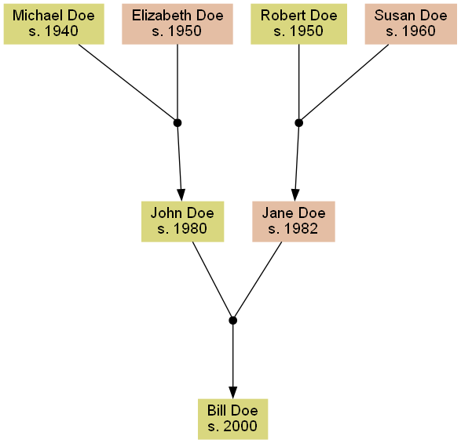

# **gedcom-tree**

Visualize ancestry data in Python.

## **Used technologies**

- Python 3.11
- [python-gedcom](https://pypi.org/project/python-gedcom/)
- [pydot](https://pypi.org/project/pydot/)
    - pydot uses [GraphViz](https://graphviz.org/) to render graphs as PDF, PNG, SVG, etc. Install it separately.
- [tqdm](https://github.com/tqdm/tqdm) for progress meter.

## **Usage**

Export a [GEDCOM file](https://en.wikipedia.org/wiki/GEDCOM) from a genealogy software like Gramps. Store the file in the root folder.

Add pointers of selected individuals to the list in `modules/linear_descendants.py` to highlight lineal descendants.

Run `py main.py` to parse the GEDCOM file and to create a graph.

## **Test**

Test with `tests/test.ged`.

## **Notes**

Python-gedcom parser supports the GEDCOM 5.5 format.

[ChatGPT](https://openai.com/blog/chatgpt/) is a large language model developed by OpenAI that is able to understand natural language and generate text in response. It was used to provide explanations and context for the code in question.